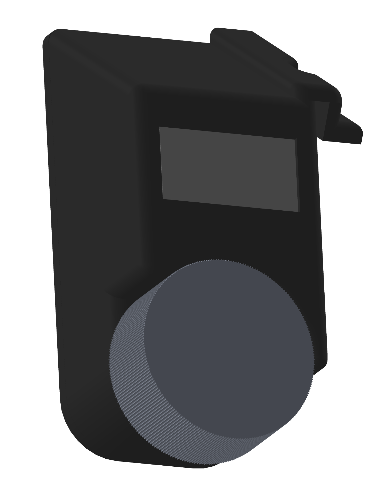

# Silvia32
Rancilio Silvia controller
Currently in progress

Designed with ESP32s3 planned to add boiler temp control, preaseure profiling, stop on weight demand all together.

Which combined the controller design of RancilioBrain but added the feature from Gaggiunio.

